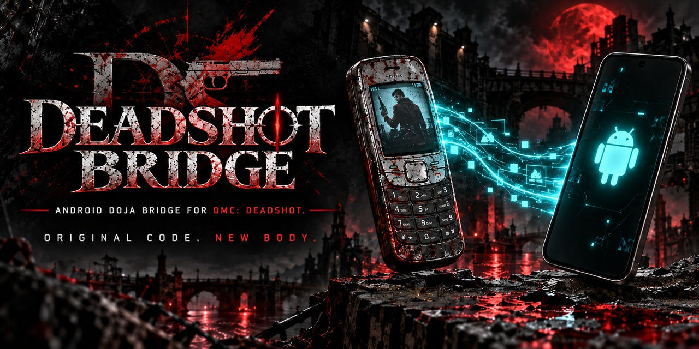

# DeadShot Bridge

DeadShot Bridge is an independent Android compatibility bridge for running a user's own compatible copy of **Devil May Cry: DeadShot** on modern Android hardware.

**Current release:** v0.1.3  
**Package:** `com.wakka.omnibridge.deadshot`

## Status

**Pre-release / polished beta.**

v0.1.3 is the first public-safe release of DeadShot Bridge.

The import → boot → gameplay path, rendering, audio, pause/resume, persistent save behavior, full phone keypad, and DeadShot-specific custom controls have been tested on a **Samsung Galaxy S25 Ultra running Android 16** and are working in the portions tested.

A complete start-to-finish playthrough has not yet been completed. Later-game compatibility issues may still exist, which is why v0.1.3 is currently published as a pre-release.

The gameplay/control baseline was finalized in v0.1.2. v0.1.3 keeps that renderer, audio path, native input behavior, scratchpad/save behavior, full phone keypad, and DeadShot-specific custom control deck while moving the original game data out of the APK and into a user-built local payload.

The v0.1.3 release-candidate import flow was successfully tested on-device. The final v0.1.3 build changes release metadata/status rather than the tested import/gameplay implementation.

## Quick start

1. Download `DeadShot_Bridge_v0.1.3.apk` from **Releases**.
2. Install it on Android 8.0 or newer.
3. Download `DeadShot_Bridge_Payload_Builder_v0.1.3.zip` from the same release and extract it on your PC.
4. Double-click `RUN-PAYLOAD-BUILDER-WINDOWS.bat`.
5. Select your own compatible DeadShot `.jar` and `.sp` files when prompted.
6. The builder creates `DeadShot_Data_for_DeadShot_Bridge_v0.1.3.zip` locally.
7. Open DeadShot Bridge on your phone and choose **IMPORT DEADSHOT DATA**.
8. Select the ZIP you just created.
9. After verification succeeds, choose **PLAY DEADSHOT**.

The payload builder does **not** download or upload game data. It only processes files already supplied by the user.

## Supported game data

The current bridge intentionally supports the exact preserved DeadShot data set used during development.

Expected original JAR SHA-256:

`e2d4dfdcb1fe7274078e5c92ce28a88996ea4e320797a908fa15d8b2500e6c56`

Expected original SP SHA-256:

`29d89f662798c8ce76d9a7fe4d664eb06a6a17b46886c0b01bd8436d3583c66d`

The `.jam` file is not required by the current payload builder.

The builder verifies the original JAR/SP before doing any conversion. It then converts the three original game classes to Android DEX and extracts/converts the four DeadShot MLD audio resources into the verified MIDI files used by the bridge.

## Controls

DeadShot has multiple native control types. The custom deck follows the game's own current `key_con` mode rather than imposing a generic mapping.

- **Modes 0 / 2:** four-way directional movement; the large right-thumb action sends native `#`.
- **Modes 1 / 3:** eight-way numeric movement; the large right-thumb action sends native `OK`.
- **Manual-attack modes 0 / 1:** the primary action is labeled **ATTACK**.
- **Auto-attack modes 2 / 3:** the primary action is labeled **DIR LOCK**.
- Native Soft1 / Soft2 surfaces only appear when DeadShot actually supplies a soft-key label.
- The toolbar **Keypad** option always exposes the complete original phone keypad.

The custom deck was tuned specifically for DeadShot after direct phone testing. It is not a reused Dirge control layout.

## What is and is not included

This repository contains the Android bridge/runtime source, build scripts, payload-builder source, compatibility interfaces, tests, and project visual assets.

It does **not** include DeadShot's original game JAR/JAM/SP, game DEX, converted DeadShot MIDI payload, locally generated DeadShot payload ZIPs, or the private signing key used for official APK updates.

## Important public-release boundary

Do not commit or upload:

- `deadshot.jar`, `deadshot.jam`, or `deadshot.sp`
- `game.dex`
- `deadshot_0.mid` through `deadshot_3.mid`
- locally generated `DeadShot_Data_for_DeadShot_Bridge_*.zip`
- signing keystores or passwords
- private phone recordings or diagnostic exports unless deliberately reviewed for publication

The included `.gitignore` blocks the common forms of these files, but the release should still be audited before publication.

## Repository layout

- `app/` — Android manifest, resources, and bridge visual assets
- `shared/` — shared Wakkan bridge shell and reporting UI
- `profiles/deadshot/` — DeadShot-specific backend, input routing, and payload importer
- `runtime/deadshot/` — DoJa compatibility/runtime layer used by DeadShot
- `tools/` — offline APK build, verification, payload builder, and MLD-to-MIDI conversion
- `tests/` — host-side behavioral regression checks
- `docs/` — build, payload, architecture, and release documentation
- `verification/` — public-safe host/device validation records

## Building the bridge APK

See [`docs/BUILDING.md`](docs/BUILDING.md).

The public source tree contains no official signing key. A local source build creates its own private signing identity. That locally signed APK will not install as an update over an official DeadShot Bridge APK signed with the project's private release identity.

## Building a personal game-data payload

See [`docs/PAYLOAD.md`](docs/PAYLOAD.md).

## Verification

See:

- [`verification/HOST_VERIFICATION_v0.1.3.md`](verification/HOST_VERIFICATION_v0.1.3.md)
- [`verification/PHONE_VALIDATION_v0.1.3.md`](verification/PHONE_VALIDATION_v0.1.3.md)

## About the original game

*Devil May Cry: DeadShot* is a Capcom mobile spin-off from the Japanese feature-phone era. DeadShot Bridge is a preservation/compatibility project only and is not affiliated with or endorsed by Capcom or NTT DOCOMO.

## License

No repository-wide license has been selected. Third-party names, trademarks, and material retain their respective ownership; see `THIRD-PARTY-NOTICES.txt`.
